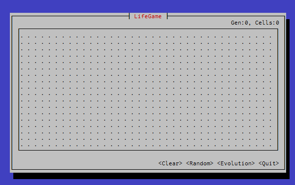

# LifeGmae

This is yet another 'Conway's Game of Life'.




## Feature

* Made by Rust langurage
* TUI (Text User Interface) by curses library
* Usable not only keyboard but also mouse
* Display the generation and total cells

## Usage

### by mouse

You can use it as you feel :)

### by keyboard

The keys correspond to the buttons.

* `c` - Clear : Kills off.
* `r` - Random : Generates cells randomly.
* `e` - Evolution : Evolves the cells.
* `q` - Quit : End of game.

## Require

This requires the following products and libraries to build.

* Rust
    * A system programming language.
* Cursive
    * A TUI (Text User Interface) library for Rust.
* A curses library
    * A terminal control library that is supported by Cursive.

## Build & Run

How to run on Ubuntu linux.

1. Clone from GitHub.

```bash
$ cd /your/favorite/path/
$ git clone https://github.com/taturou/lifegame-rust-cli.git
```

2. Build by cargo

```bash
$ cd lifegame-rust-cli
$ cargo build
```

3. Run

```bash
$ cargo run
```

## Future work

* Auto evolution
    * Now you need to keep clicking the `<Evolution>` button.
* Automatic detection of convergence
* Refactoring to Rust-ish

## License

MIT License

